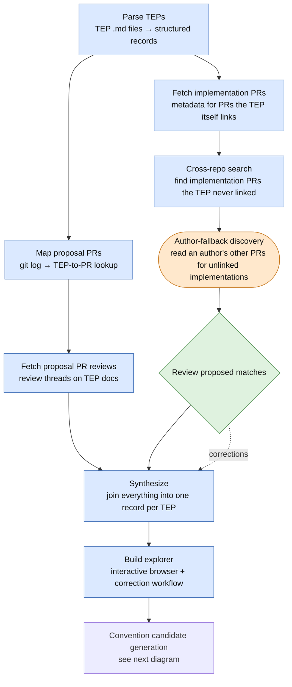
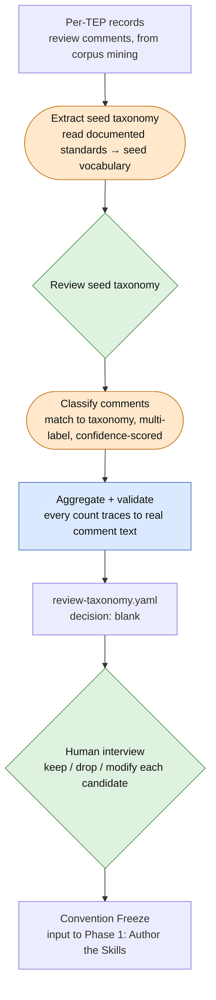

# TEP-0173 Phase 0a: Corpus Mining — Data Collection Plan

## Overview

This plan covers the data collection, storage, and synthesis work for **Phase 0a (Corpus Mining)**
of [TEP-0173](0173-enhancement-proposal-authoring-skills.md). The goal is to derive TEP conventions
empirically from the `tektoncd/community/teps/` corpus and its associated GitHub PR history, then
present a synthesized candidate set to TEP process maintainers for a keep/drop/modify interview
(Phase 0b: Convention Freeze).

The output feeds directly into the four skill bodies and their reference documents; no separate
project-config layer exists to route them through.

### Scope

Two-pass approach:
- **Pass 1 (targeted)**: a curated sample of ~20–30 implemented TEPs — the most-iterated and
  those with the most implementation PRs. Produces fast signal, validates the pipeline end-to-end,
  and is sufficient for the interview step in most cases.
- **Pass 2 (full corpus)**: expand to all 83 implemented TEPs only if the interview step reveals
  gaps the sample did not cover.

### Repository

Scripts and data live in a new repository **`afrittoli/tep-mining`** (or a branch on
`afrittoli/community` with no PR to the main repo). Nothing from this work is committed to
`tektoncd/community` until the frozen conventions are ready for the skills themselves.

---

## Repository Layout

```
afrittoli/tep-mining/
├── README.md
├── Makefile                        # targets: fetch, parse, process, query
├── pyproject.toml                  # uv-managed: requests, ruamel.yaml, jinja2
├── .env.example                    # GITHUB_TOKEN=, COMMUNITY_REPO_PATH=
│
├── scripts/
│   ├── parse_teps.py               # offline: TEP .md -> raw/teps.jsonl
│   ├── fetch_tep_prs.py            # API: TEP PR metadata + reviews -> community_prs.jsonl, community_pr_reviews.jsonl
│   ├── fetch_impl_prs.py           # API: impl PR metadata + reviews -> impl_prs.jsonl, impl_pr_reviews.jsonl
│   ├── cross_repo_search.py        # API: GH search for uncited TEP references
│   ├── synthesize.py               # joins raw/ -> processed/YYYY-MM-DD/per_tep_records.json
│   └── validate_conventions.py     # mechanical check: conventions/review-taxonomy.yaml traces back to real comment text (Sub-Task 8)
│
├── prompts/
│   ├── extract_seed_taxonomy.md    # AI reads documented sources -> conventions/seed-taxonomy.yaml (Sub-Task 8)
│   └── author_fallback_discovery.md # prompt template for AI-assisted impl-PR fallback discovery
│
├── raw/                            # JSONL, git-tracked, append-only
│   ├── teps.jsonl
│   ├── community_prs.jsonl
│   ├── community_pr_reviews.jsonl
│   ├── impl_prs.jsonl
│   └── impl_pr_reviews.jsonl
│
├── processed/
│   ├── latest -> YYYY-MM-DD/       # symlink to most recent run
│   └── YYYY-MM-DD/
│       └── per_tep_records.json
│
├── overrides/                      # human-edited JSONL, git-tracked (git history is the audit trail)
│   ├── section_overrides.jsonl
│   ├── pr_attribution_overrides.jsonl
│   └── known_commits.jsonl
│
└── conventions/                    # human-annotated YAML
    ├── seed-taxonomy.yaml          # human-reviewed input (not a candidate awaiting decision) - Sub-Task 8
    └── review-taxonomy.yaml        # Sub-Task 8
```

---

## Storage Design

### Raw layer — JSONL (append-only, git-tracked)

One `.jsonl` file per data type. Each record is a complete, self-describing JSON object. Files
are append-only: fetch scripts check for an existing `id` field before making an API call, so
re-running accumulates new records without touching existing ones. Git diffs are meaningful
(each new record is one added line).

| File | Content | Key field |
|---|---|---|
| `raw/teps.jsonl` | Parsed TEP frontmatter + section structure | `tep_number` |
| `raw/community_prs.jsonl` | GH PR metadata for TEP proposal PRs in `tektoncd/community` | `pr_number` |
| `raw/community_pr_reviews.jsonl` | Review threads on TEP proposal PRs | `pr_number` + `comment_id` |
| `raw/impl_prs.jsonl` | GH PR metadata for implementation PRs across `tektoncd/*` repos | `repo` + `pr_number` |
| `raw/impl_pr_reviews.jsonl` | Review comments on implementation PRs | `repo` + `pr_number` + `comment_id` |

### Processed layer — versioned JSON snapshots

Each processing run writes to a new `processed/YYYY-MM-DD/` directory. Nothing is overwritten.
The `latest` symlink points to the most recent run. Any AI agent or processing script can be
pointed at `processed/latest/` to work from the current best snapshot without hard-coding a date.

### Annotation layer — YAML (human-edited)

Two files under `conventions/`, produced by Sub-Task 8. `seed-taxonomy.yaml` is human-reviewed
*input* (no `decision:`/`rationale:` — it's not a candidate awaiting a call, see Sub-Task 8).
`review-taxonomy.yaml` is the AI-proposed *output*: candidate conventions with observed-frequency
evidence and a `decision:` field the human interviewer fills in during Phase 0b — the direct
input to Convention Freeze.

```yaml
# conventions/review-taxonomy.yaml (example structure)
id: review-taxonomy
description: "What review comments actually raise, classified against documented standards"
facets:
  principle:
    - value: simplicity
      source: "design-principles.md#simplicity"
      count: 214
      confidence: {high: 180, medium: 30, low: 4}
      examples:
        - {tep: 45, pr: "pipeline#3738", quote: "do we need a new field for this, or can..."}
    - value: security
      source: "design-principles.md#security"
      count: 58
      confidence: {high: 50, medium: 8, low: 0}
      examples: [...]
  artifact:
    - value: tests
      source: "standards.md#tests"
      count: 340
      confidence: {high: 300, medium: 40, low: 0}
      examples: [...]
  nature:                    # no seed - built bottom-up from what classification finds
    - value: "backward compatibility"
      count: 41
      confidence: {high: 20, medium: 15, low: 6}
      examples: [...]
ai_recommendation: "..."
decision: ~        # keep / "modify: <text>" / drop
rationale: ~       # interviewer's reasoning
```

### Ad-hoc querying

A `Makefile` target loads all JSONL into an in-memory DuckDB session for SQL queries during
the synthesis stage. No DuckDB file is stored; JSONL remains the source of truth.

### Orchestration: why plain `make`, not a data-pipeline framework

Considered (2026-07-29) whether an established orchestrator — Airflow, Dagster, Prefect,
Snakemake — should replace the `Makefile` + per-script idempotency checks now that the pipeline
has grown to nine ordered stages. Decision: **keep the Makefile**, revisit only if the shape of
the problem changes.

Reasoning: those tools earn their cost on recurring, scheduled, multi-team production pipelines
— retries, alerting, backfills, distributed execution, a UI for run history. This pipeline is
none of that: single machine, single user, human-triggered, runs end when Phase 0a does. Total
wall-clock cost is dominated by GitHub API rate limits, not compute, so there's no parallelism
to exploit even if a DAG scheduler were introduced. Airflow/Dagster/Prefect would mean
standing up a scheduler, learning a DAG-definition API, and rewriting every script as a typed
task/asset — real cost for a pipeline that already works and has a natural end date.
Snakemake is the closest fit in spirit (declare "these outputs depend on these inputs, only
rerun what's stale," built for exactly this kind of file-dependency data-processing pipeline,
far lighter than Airflow) — worth a second look only if the pipeline needs to become a
recurring/scheduled job (e.g. keeping the corpus mining current after Phase 0a ships), which
isn't the current goal.

What the Makefile is already missing that a real orchestrator would give for free: dependency
order is enforced by doc comments ("Sub-Task 6 must run after `make fetch-impl-prs`"), not by
the tool — a wrong invocation order fails at runtime, not before. Each script re-implements its
own idempotency (skip-if-`(repo, pr_number)`-already-in-file) rather than the orchestrator
handling staleness uniformly. Acceptable for a pipeline this size, run by the person who wrote
it — a real friction point only for a wider group of maintainers.

---

## Sub-Tasks

### Sub-Task 1: Bootstrap the `tep-mining` repository

**Intent**: Create the repository and project scaffolding so all subsequent sub-tasks have a
stable place to land.

**Expected Outcomes**:
- `afrittoli/tep-mining` repository exists (or a dedicated branch on `afrittoli/community`)
- `pyproject.toml` and `uv.lock` present with the required dependencies
- `Makefile` with placeholder targets: `parse`, `fetch-tep-prs`, `fetch-impl-prs`, `search`,
  `synthesize`, `query`
- `.env.example` documenting `GITHUB_TOKEN` and `COMMUNITY_REPO_PATH`
- Empty `raw/`, `processed/`, `conventions/`, `scripts/`, `prompts/` directories with
  `.gitkeep` files
- `README.md` describing the pipeline stages and how to run each

**Todo List**:
1. Create repository (or branch)
2. Write `pyproject.toml` with deps: `requests`, `ruamel.yaml`, `python-dotenv`, `jinja2`; add
   `duckdb` as an optional dev dependency for ad-hoc querying
3. Write `Makefile` with stub targets and a `help` default
4. Write `.env.example`
5. Create directory stubs
6. Write `README.md` with pipeline overview and quickstart

**Relevant Context**:
- `tektoncd/community/teps/tools/teps.py` uses `ruamel.yaml` and `uv` — reuse same toolchain
- `GITHUB_TOKEN` env var convention already established in `teps.py` Phase 0c work

**Status**: [ ] pending

---

### Sub-Task 2: Offline TEP parsing (`parse_teps.py`)

**Intent**: Extract all structured data available from the TEP `.md` files without any API
calls, producing `raw/teps.jsonl` as the foundational dataset that all subsequent stages join
against.

**Expected Outcomes**:
- `raw/teps.jsonl` contains one record per TEP with:
  - Frontmatter fields: `tep_number`, `title`, `status`, `authors`, `collaborators`,
    `creation_date`, `last_updated`
  - Derived fields: `age_days` (creation to last-updated), `sections_present` (list of H2/H3
    headings found), `word_count_per_section` (dict), `impl_pr_links` (list of extracted GitHub
    PR URLs from the Implementation section), `impl_pr_links_format` (classified: full-url /
    shorthand / markdown-link)
  - `source_file`: relative path to the `.md` file
- Running the script a second time with new TEP files appends new records (idempotent on
  existing `tep_number` values)
- A summary printed to stdout: total TEPs parsed, breakdown by status, count with/without
  implementation PR links

**Todo List**:
1. Write `scripts/parse_teps.py`:
   - Accept `--teps-dir` (path to `community/teps/`) and `--output` (default `raw/teps.jsonl`)
   - Use `ruamel.yaml` to parse frontmatter (same library as `teps.py`)
   - Extract H2/H3 headings with a regex on the markdown body
   - Extract GitHub PR URLs with a regex: `https://github\.com/tektoncd/[^/]+/pull/\d+`
   - Classify link format per link
   - Load existing JSONL, skip records with matching `tep_number`, append new ones
2. Add `parse` target to `Makefile`
3. Run against the local `community/teps/` checkout and commit the resulting `raw/teps.jsonl`

**Relevant Context**:
- TEP frontmatter required fields: `title`, `authors`, `creation-date`, `status` (from `teps.py`
  line 58: `REQUIRED_FIELDS`)
- Implementation PR link section heading varies: "Implementation Pull request(s)",
  "Implementation PRs", "Implementation Pull Requests" — matched by `RE_IMPL_PR_HEADING`, but
  **scoped to that section specifically, not the whole document body** (see note below; this
  supersedes the original "section-agnostic, scan the full body" design — that turned out to
  cause real, corpus-wide mis-attribution)
- Withdrawn/deferred TEPs (6 total) should be included but tagged; they form the contrast set
  mentioned in TEP-0173 Phase 0a

**Note (correction, discovered via manual review of TEP-0075's data)**: the original design
scanned the *entire* TEP body for PR links, on the theory that heading text was too
inconsistent to rely on. In practice this meant any PR a TEP cross-referenced as related work
(e.g. "see also TEP-0076" in Motivation, Requirements, or Design Details) got counted as this
TEP's own implementation — confirmed on TEP-0075, where 3 of 19 "linked" PRs were actually
TEP-0048/0074/0076's own proposal PRs. `_extract_pr_links()` is now called on
`_implementation_section_text(body)` — the text under any heading matching
`RE_IMPL_PR_HEADING` (`implementation.*\b(pull requests?|prs?)\b`, case-insensitive; handles
"Pull Requests", "Pull request(s)", and "PRs" at any `##`/`###` level, including the template's
nested `### Implementation Pull Requests` under `## Implementation Plan`). A TEP with no
matching heading gets zero linked PRs, rather than falling back to a whole-body scan — a
deliberate choice to keep precision over recall, made explicitly after measuring the cost: only
62 of 147 real TEPs have a heading a matcher can find at all, so the other 85 lose up to 160
previously-"linked" PRs corpus-wide (many legitimate, filed under a bare "References" section or
scattered inline prose with no dedicated PR-list heading). Cross-repo search (Sub-Task 6) and
manual `include` overrides (see Sub-Task 7) are the intended recovery path for those, one
verified PR at a time, rather than accepting the false-positive rate a whole-body fallback would
reintroduce.

**Status**: [x] done

---

### Sub-Task 3: TEP PR discovery via git log

**Intent**: Identify the GitHub PR numbers for TEP proposal PRs from the `community/` git log,
without any API calls. This produces the input list for Sub-Task 4 (fetching review threads).

**Expected Outcomes**:
- A JSON mapping `tep_number -> community_pr_number` for all TEPs whose merge commit is
  recoverable from the git log
- Coverage stats printed: how many implemented TEPs have a recoverable PR number vs. not
- The mapping saved to `raw/tep_pr_map.json` (not JSONL; it's a lookup table, not a record
  stream)

**Todo List**:
1. Write a script section in `parse_teps.py` (or a separate `scripts/map_tep_prs.py`) that:
   - Runs `git log --merges --format="%H %s"` on the `community/` repo using `subprocess`
   - Matches subject lines of the form `Merge pull request #N` combined with a `TEP-NNNN`
     reference in either the subject or the commit body (`git log --format="%H %s %b"`)
   - Falls back to scanning commit subjects for `TEP-NNNN:` pattern on non-merge commits
   - Writes `raw/tep_pr_map.json`
2. Cross-check: for each TEP in `raw/teps.jsonl`, verify the PR number found in the git log
   matches the TEP number; flag mismatches
3. Add `map-prs` target to `Makefile`

**Relevant Context**:
- GitHub merge commits in the community repo have the subject
  `Merge pull request #N from branch/name`, with the TEP title often in the body
- Some early TEPs (0001–0020) may have been merged before consistent PR titling; coverage will
  be partial — record this explicitly in the stats output

**Status**: [ ] pending

---

### Sub-Task 4: Fetch TEP proposal PR review threads (`fetch_tep_prs.py`)

**Intent**: Retrieve review comments on TEP proposal PRs from the `tektoncd/community` GitHub
repo. This is the primary source of signal for `writing-guide.md` and the `tep-review` skill —
it reveals which sections drew repeated iteration and what reviewers rejected.

**Expected Outcomes**:
- `raw/community_prs.jsonl`: one record per TEP proposal PR with title, body, labels, created/
  merged dates, reviewer logins, review decision
- `raw/community_pr_reviews.jsonl`: one record per review comment with `pr_number`, `comment_id`,
  `body`, `path` (file), `line`, `author`, `created_at`
- Incremental: re-running skips PR numbers already present in the JSONL
- Rate-limit aware: honours `GITHUB_TOKEN`; logs rate-limit state on first observation, when crossing 100-request buckets, and near exhaustion, sleeping until reset below the threshold
- Generates `reports/tep_pr_reviews.html` summarising fetched PR records and review comments
- Current project decision: run against all mapped TEP PRs for now; `--sample` remains available for a future curated subset

**Todo List**:
1. Write `scripts/fetch_tep_prs.py`:
   - Accept `--pr-map` (path to `raw/tep_pr_map.json`), `--sample` (comma-separated TEP
     numbers for Pass 1), `--all` flag for Pass 2
   - Use the GitHub REST API: `GET /repos/tektoncd/community/pulls/{pr_number}/reviews` and
     `GET /repos/tektoncd/community/pulls/{pr_number}/comments`
   - Load existing JSONL files; skip records with matching `pr_number` + `comment_id`
   - Handle pagination (`Link: <...>; rel="next"` header)
   - Respect `X-RateLimit-Remaining`; sleep until `X-RateLimit-Reset` if below a threshold (10)
2. Document the current execution decision in `README.md`: run all mapped TEP PRs for now,
   while keeping `--sample` available for a future curated subset.
3. Add `fetch-tep-prs` target to `Makefile`, including HTML report output
4. Run the full mapped PR set and commit the resulting JSONL and report artifacts

**Relevant Context**:
- `GITHUB_TOKEN` / `GH_TOKEN` precedence already established in TEP-0173 Phase 0c for `teps.py`
- Unauthenticated rate limit: 60 req/hr; authenticated: 5000 req/hr — always use a token
- Review comments API returns inline comments; PR review API returns top-level review summaries
  with approve/request-changes decisions — fetch both

**Status**: [x] done

---

### Sub-Task 5: Fetch implementation PR metadata and reviews (`fetch_impl_prs.py`)

**Intent**: Retrieve metadata and review comments for implementation PRs across `tektoncd/*`
repos. This is the primary source for `tep-pr-conventions` — PR title/body patterns, linking
syntax, PR count and size per TEP, feature-flag usage.

**Expected Outcomes**:
- `raw/impl_prs.jsonl`: one record per (repo, pr_number) with title, body, labels, files
  changed, additions, deletions, linked issues, created/merged dates
- `raw/impl_pr_reviews.jsonl`: review comments on implementation PRs (same schema as
  `community_pr_reviews.jsonl` plus `repo` field)
- Coverage stats: how many PRs in `impl_pr_links` from `raw/teps.jsonl` were successfully
  fetched vs. 404 (deleted/transferred)
- Current project decision: run against all TEPs with implementation PR links for now (matches
  Sub-Task 4); `--sample` remains available for a future curated subset. Every record written
  (including 404s) carries `discovered_via: "tep_file_link"`, since this script only ever
  fetches PRs the TEP author already linked — see Sub-Task 6 for the complementary discovery
  mechanism.

**Todo List**:
1. Write `scripts/fetch_impl_prs.py`:
   - Input: reads `raw/teps.jsonl`, extracts all `impl_pr_links` for TEPs in the Pass 1 sample
   - Groups links by `(org, repo, pr_number)` tuples extracted from URLs
   - Fetches `GET /repos/tektoncd/{repo}/pulls/{pr_number}` for each
   - Fetches `GET /repos/tektoncd/{repo}/pulls/{pr_number}/reviews` and `/comments`
   - Incremental: skips existing `(repo, pr_number)` records
   - Same rate-limit handling as Sub-Task 4
2. Add `fetch-impl-prs` target to `Makefile`
3. Run for the Pass 1 sample and commit JSONL

**Relevant Context**:
- Implementation PRs span repos: `pipeline`, `triggers`, `cli`, `dashboard`, `results`,
  `chains`, `operator` — the fetch script must handle all of them generically via the `(repo,
  pr_number)` tuple
- Some early TEPs link to PRs that may be closed/deleted; 404 responses should be recorded
  as `{"repo": ..., "pr_number": ..., "status": 404}` in the JSONL so the gap is visible

**Status**: [x] done

---

### Sub-Task 6: Cross-repo TEP reference search (`cross_repo_search.py`)

**Intent**: Augment `raw/impl_prs.jsonl` by discovering implementation PRs that reference a
TEP but were *not* linked in the TEP file itself and therefore not fetched by Sub-Task 5.
This quantifies the under-linking problem documented in TEP-0173 and surfaces PRs that the
offline-link extraction misses. Sub-Task 5 must complete first; this sub-task extends its
output, it does not replace it.

**Expected Outcomes**:
- `raw/impl_prs.jsonl` augmented with newly discovered PRs not already in the file
- A summary report: for each TEP in the sample, how many PRs were found via search vs. already
  linked in the TEP file — the delta is the under-linking rate
- Coverage stats recorded in `processed/YYYY-MM-DD/coverage.json`
- Current project decision: run against all TEPs for now (matches Sub-Tasks 4 and 5); `--sample`
  remains available. Search hits in `tektoncd/community` matching a TEP's own known PR numbers
  (from `raw/tep_pr_map.json`) are excluded — they're the TEP's own proposal/doc history, not a
  missed implementation PR. Hits are re-confirmed against the exact TEP number requested before
  being counted, since GitHub's search tokenization on a quoted phrase isn't a guaranteed exact
  match.
- Result of the first full run (2026-07-27): 274 already-linked implementation PRs vs. 649
  newly discovered via search, across 156 TEPs — an under-linking rate of **70.3%**. Confirms
  the concern raised in TEP-0173 Phase 0a: the offline `impl_pr_links` extraction alone would
  have missed the majority of actual implementation PRs.
- **Query widened (2026-07-29)**, found via a direct question about TEP-0109: `chains#491`
  ("[TEP 109] Add feature to extract structured signable targets...") was invisible to search
  entirely, because its title/body use "TEP 109" — space-separated, no zero-padding — and the
  query only ever searched the quoted phrase `"TEP-0109"`. The confirmation regex
  (`RE_TEP_CONFIRM`) already tolerated that form; only the query didn't. Now queries
  `("TEP-{NNNN}" OR "TEP {N}") type:pr` in one call (padded-dash + non-padded-space) — verified
  empirically before landing it: for TEP-0109, the padded-dash-only query returns 3 raw hits,
  adding the non-padded-space OR term brings it to 9 (still includes chains#491), while also
  adding non-padded-*dash* as a third term jumps to 22 — mostly noise, consistent with the
  original investigation's finding that non-padded dash added nothing genuine. The extra OR
  term costs nothing beyond this one search call: `_confirmed_hits()` re-verifies every hit's
  actual text before anything gets fetched, so wider raw recall doesn't cost extra fetches or
  rate-limit spend, only a marginally larger response to filter.

**Todo List**:
1. Write `scripts/cross_repo_search.py`:
   - Use the GH search API: `GET /search/issues?q=org:tektoncd+"TEP-{NNNN}"+type:pr` for each
     TEP in the Pass 1 sample
   - The search API has a separate rate limit (30 req/min authenticated); add a 2-second sleep
     between requests
   - For each PR returned, check if it is already in `raw/impl_prs.jsonl` (by `repo` +
     `pr_number`); if not, fetch its full metadata via the REST API and append it — using the
     same fetch logic as Sub-Task 5
   - All records written by Sub-Task 5 carry `discovered_via: "tep_file_link"`; records added
     here carry `discovered_via: "search"` — this field is set at write time, not modified
     retroactively
2. Add `search` target to `Makefile`; document in `README.md` that it must run after
   `fetch-impl-prs`
3. Run for the Pass 1 sample; record coverage stats in `processed/YYYY-MM-DD/coverage.json`

**Relevant Context**:
- TEP-0173 Phase 0a explicitly notes: "Linking discipline is known to be inconsistent, so
  recall will be partial; record coverage stats rather than assuming completeness"
- The search API returns at most 1000 results per query; for strings like "TEP-0075" this is
  unlikely to be an issue, but page through results if `total_count > 30`
- Sub-Task 5 already sets `discovered_via: "tep_file_link"` on every record it writes; this
  sub-task must not modify existing records, only append new ones

**Status**: [x] done

---

### Sub-Task 6b: Author-fallback implementation-PR discovery (`prompts/author_fallback_discovery.md`)

**Intent**: Recover implementation PRs that Sub-Task 6's text search structurally cannot find —
PRs that never mention "TEP-NNNN" anywhere, opened by one of the TEP's own listed authors, whose
content is nonetheless genuinely the TEP's implementation. Text search cannot narrow this any
further than "search by author" without risking false negatives (tested and rejected: date
windowing and keyword narrowing both silently exclude real hits — see the prompt file for the
concrete cases). This is an AI-agent task, not a deterministic script — the actual work is
reading a PR's content against a TEP's actual content and judging fit, which is exactly the kind
of judgment call a regex or keyword filter gets wrong.

**Expected Outcomes**:
- `prompts/author_fallback_discovery.md`: a prompt template documenting the search procedure,
  the reading/judging criteria, known false-positive traps observed on real data, and the
  required output shape (matching `overrides/pr_attribution_overrides.jsonl`)
- Running it produces proposed `include` records for human (or reviewing-agent) sign-off, not
  direct commits — same review discipline as every other correction mechanism in this pipeline
- First real run (2026-07-30, on the "implemented + zero impl PRs" cohort) found 5 genuine hits
  this way, all previously invisible to Sub-Task 6 for the same underlying reason: zero "TEP"
  text anywhere in the PR, matched only by the PR's own author being a listed TEP author

**Todo List**:
1. Write `prompts/author_fallback_discovery.md` (done — see the file for the full procedure)
2. Run it against the current "flagged for review" cohort (`status: implemented`,
   `impl_prs.total_count == 0`) as the first real execution; review and apply findings via
   `scripts/apply_export.py`, then re-run `make synthesize`
3. Re-run periodically as new corrections surface more of these gaps, or on demand for a
   specific TEP under manual review

**Relevant Context**:
- Companion mechanism to Sub-Task 6, not a replacement — text search stays the default (cheap,
  deterministic, runs unattended); this is the fallback for what it structurally cannot see
- This project's second AI-agent-driven pipeline stage — the first is Sub-Task 8's
  `extract_seed_taxonomy.md` / comment classification — for the same underlying reason: some
  steps need reading comprehension, not string matching, and a heuristic that fakes it produces
  silently wrong data
- Known limitation: an author whose GitHub account has been deleted breaks the `author:` search
  qualifier itself (`422 Validation Failed`), the same root cause `known_commits.jsonl` exists
  for on the commit-linkage side — no current workaround for either

**Status**: [x] done (prompt written and dogfooded); re-run as needed, not a one-time step

---

### Sub-Task 7: Synthesis — join raw data into per-TEP records (`synthesize.py`)

**Intent**: Join all raw JSONL files into a single structured record per TEP, making the data
ready for AI grouping. This is the bridge between raw collection and the convention-candidate
generation step.

**Expected Outcomes**:
- One joined record per TEP, combining its metadata, proposal review activity, and
  implementation PR history in one place, refreshed into a new dated snapshot on every run.
- Review comments are attributed to the TEP section they relate to, surfacing which parts of a
  TEP drew the most discussion; a wrong attribution can be corrected by hand.
- Implementation PRs are attributed with a confidence tier, not a single yes/no: a PR the TEP's
  own author links directly is trusted outright, a PR found only through search is confirmed
  automatically when the evidence is strong, and weaker matches are held for a person to confirm
  or dismiss instead of being counted automatically. Bot activity is excluded throughout.
- Implementations that exist only as a bare commit, with no pull request to review, are tracked
  as their own explicitly-curated case rather than showing up as a missing implementation.
- Each record surfaces likely inconsistencies worth a second look — for example, a TEP marked
  implemented with no confirmed implementation PR — so they can be found by scanning instead of
  opening every TEP.
- An interactive browser over the joined data supports filtering and sorting, and is where
  corrections get made — flagging a wrong attribution, adding a missed PR or commit, fixing a
  comment's section. Corrections are reviewed and applied back onto the source data as a
  separate, auditable step, never written automatically.

**Todo List**:
1. Join script: load every raw file, build one record per TEP, write a new dated snapshot.
2. Interactive browser over the joined data.
3. A round-trip path for corrections made in the browser to reach the source data.
4. Ad-hoc SQL exploration over all raw and joined data, for review during synthesis.

**Relevant Context**:
- The join between review threads and TEPs goes through the TEP-to-proposal-PR mapping
  (Sub-Task 3), not a direct field.
- Review-round counts are approximate: only comment dates are available, not individual review
  submission events.

**Status**: [x] done

---

### Sub-Task 8: Review-comment taxonomy (`conventions/review-taxonomy.yaml`)

**Intent**: Classify review comments across the corpus against a small, controlled vocabulary
seeded from the community's own documented standards, so recurring feedback can be read as
evidence for or against a convention rather than left as unstructured text.

**Expected Outcomes**:
- A seed vocabulary for classification, drawn from the community's existing written standards
  rather than invented, with each value traceable to where it's already documented, and each
  facet itself (not just its values) carrying a stated definition — what it means for a comment
  to be classified along that dimension at all. Reviewed and adjusted by a person before it's
  used for anything.
- Every review comment classified against that vocabulary along more than one independent
  dimension (broadly: which principle it invokes, and what part of the contribution it concerns).
  The dimensions are independent lenses, not a hierarchy and not combined into one joint label:
  within a dimension a comment may match zero, one, or several values, each with its own
  confidence rather than a strict yes/no, and a comment may match nothing at all across every
  dimension — most comments are purely procedural ("can you rebase," "LGTM") and that has to be
  a legitimate outcome, not a gap the classification is pushed to fill. A comment that fits
  nothing well proposes a new value instead of being forced into the closest existing one — the
  actual mechanism for surfacing conventions nobody wrote down.
- Classification stored per comment — which values it matched, on which dimension, at what
  confidence — not collapsed straight into per-value counts. Aggregate counts are a view derived
  from that, not the primary record, so co-occurrence (which comments matched more than one
  value at once, on the same or different dimensions) stays queryable, and every reported count
  traces back to real, quotable comment text by construction rather than as a separate check.
- A result set with decision fields left blank for the human interview step.

**Todo List**:
1. Propose a seed vocabulary from documented sources; human review before use.
2. Classify review comments against the reviewed vocabulary, across the full corpus rather
   than a fixed curated sample — approached iteratively (pilot on a handful of TEPs first,
   review the results, refine, then expand) across repeated agent-driven runs, not a single
   pass, and not new batch-API infrastructure.
3. Aggregate the classification into the result set.
4. Verify every reported count traces back to real comment text.

**Relevant Context**:
- The seed vocabulary comes from this org's own documented design principles and contributor
  standards, plus its API compatibility policy — not invented, and not derived from the corpus
  being classified.
- This sub-task exists because reviewing comment *content* for recurring feedback is explicitly
  part of TEP-0173's corpus-mining goal, and nothing else in this pipeline captures it — Sub-Task
  7 deliberately limited itself to comment counts, not content.

**Status**: [ ] pending

---

### Sub-Task 9: Human interview — convention freeze input

**Intent**: Present the AI-grouped convention candidates to TEP process maintainers as a
structured keep/drop/modify questionnaire. The filled-in `conventions/*.yaml` files become
the input to Phase 0b (Convention Freeze).

**Expected Outcomes**:
- All five `conventions/*.yaml` files have `decision:` and `rationale:` fields filled in
- A `conventions/SUMMARY.md` capturing the key decisions made and any open questions deferred
  to Phase 0b
- Divergences between documented process and observed practice are explicitly called out,
  with a decision on each

**Todo List**:
1. Schedule the interview session(s) with TEP process maintainers
   (`OWNERS` in `community/teps/`)
2. Walk through each `conventions/*.yaml` file: present the `observed_variants`,
   `ai_recommendation`, and ask for a `decision`
3. Fill in `decision:` and `rationale:` fields during or immediately after the session
4. Write `conventions/SUMMARY.md` with decisions and any deferred items
5. Commit the annotated `conventions/*.yaml` files and `SUMMARY.md` — this commit is the
   handoff to Phase 0b

**Relevant Context**:
- TEP-0173 Phase 0a step 5: "present the synthesis as keep/drop/modify questions to the TEP
  process maintainers so skills encode deliberate choices, not corpus averages. Values freeze
  into the skills only after this step."
- TEP-0173 Drawbacks: "Corpus-mining conventions from historical TEPs risks calcifying past
  practice into the skills … unless the interview step is actually used to make deliberate
  choices rather than rubber-stamping mined averages."
- This sub-task's completion is the gate for Phase 0b (Convention Freeze) to begin

**Status**: [ ] pending

---

## Data Flow

Three kinds of step, shown as three shapes below — this is the answer to "how reproducible is
this, from zero, and where does an LLM actually touch the data":

- **Rectangle = script.** A deterministic `make` target, byte-for-byte reproducible given the
  same raw inputs, runnable unattended.
- **Rounded/stadium = AI agent.** Requires an agentic AI session (Claude Code or equivalent) to
  read a `prompts/*.md` file and execute it. Not automatically reproducible run-to-run — which is
  exactly why every one of these writes proposals into a reviewable file rather than committing
  directly.
- **Diamond = human.** A review or decision gate. No script, no AI, a person looking at output
  and deciding.

Rebuilding from zero means walking this graph top to bottom: run the script stages, and at each
AI-agent stage, have an agent execute the named prompt file and a human clear the following
review gate before the pipeline continues.

### Corpus mining (Sub-Tasks 2–7)



### Convention candidate generation (Sub-Task 8)



---

## References

- [TEP-0173: Enhancement Proposal Authoring Skills](https://github.com/tektoncd/community/blob/main/teps/0173-enhancement-proposal-authoring-skills.md)
- [TEP-0173 Phase 0a description](https://github.com/tektoncd/community/blob/main/teps/0173-enhancement-proposal-authoring-skills.md#phase-0a-corpus-mining)
- [`teps/tools/teps.py`](https://github.com/tektoncd/community/blob/main/teps/tools/teps.py) — ground truth for numbering and scaffolding
- [GitHub REST API: Pull Request Reviews](https://docs.github.com/en/rest/pulls/reviews)
- [GitHub Search API](https://docs.github.com/en/rest/search)
